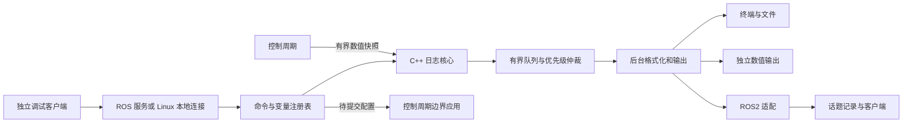

# Dust 日志与调试台迁移规划：ROS2 与纯 C++ 能力对照

> 日期：2026-10-08。依据当前仓库源码、`temp/Dust_Zephyr_Tree/framework/cmd/shell` 实现、本机 ROS2 Jazzy 接口与官方 Jazzy 文档。
> 本文是设计规划，本次只新增文档，不修改现有控制、日志或参数生效逻辑。
> 建议：保留 Dust 的日志业务语义，建立不依赖 ROS 的 C++ 核心；ROS2 提供跨节点命令、参数和数据记录适配。先完成可选择调试流，再逐步增加异步输出与调参。

## 1. 先给结论

**ROS2 能实现这些功能，但 `RCLCPP_INFO/DEBUG` 本身不是原 shell 的完整替代品。** 原生日志适合等级事件、节流及 `/rosout`；按名字单选流、切流清理、三档发送仲裁、VOFA 数字流和变量实际生效，都需要额外业务实现。

**不使用 ROS2，纯 C++ 也能覆盖原系统全部可见业务功能。** 日志、源选择、命令解析、变量注册、异步队列和文件输出不依赖 DDS。不同之处是跨进程发现、远程调用、消息序列化与录制工具需要自行提供，或通过 Linux 接口实现。

这里的“能覆盖”表示可以实现，不表示 C++ 标准库已经提供完整日志平台，更不表示原 Zephyr 源码能直接编译。也不以未经测试的百分比表示覆盖率。

区分三种方案：

| 方案 | 能力边界 | 本项目适用性 |
|---|---|---|
| 只使用 ROS2 原生日志、参数和工具 | 快速具备事件日志、参数服务、话题记录；缺少 Dust 调试台的若干语义 | 可先解决现场选择和查看问题 |
| ROS2 + 自研调试核心 | 能覆盖原调试台业务，同时接入多节点系统 | 推荐用于当前项目 |
| 无 ROS2 的 C++ 核心 + Linux 接口 | 同样能覆盖原业务；跨进程通信与客户端需另做 | 推荐作为核心独立运行和未来 Linux 部署形态 |

## 2. 原系统实际做了什么

源码入口：[shell 模块 README](../temp/Dust_Zephyr_Tree/framework/cmd/shell/README.md)。以下以实现为准，README 的容量实测不作为当前 PC 的性能结论。

| 源文件 | 已有职责 |
|---|---|
| `log.hpp / log.cpp` | `DUST_LOG_INF/ERR/OK/WRN/DBG`，日志门面、命令、同步/异步阶段切换 |
| `log_debug.hpp` | 命名 DBG 源注册、单选、VOFA 模式、选择代数 epoch |
| `log_policy.hpp` | 事件、命令、调试流的优先级及颜色策略 |
| `log_record.hpp` | 可变参数快照、后台格式化、文本与颜色包装 |
| `log_queue.hpp` | 原始记录池与发送帧池、索引链表、过载丢弃、作废记录回收 |
| `log_transport.hpp` | 绑定 Stream、DMA 空闲提交、发送完成后唤醒 |
| `var.hpp / var.cpp` | 链接段收集变量、按类型 list/get/set |
| `shell.hpp / shell.cpp` | UART 输入、逐行命令、退格、帮助、格式化与发送泵驱动 |

原调试流的关键语义：

- 普通事件调用即请求输出；DBG 默认静默，`log on <name>` 同时只选择一个源。
- `log mode <name> on|off` 为每个源独立设置 VOFA 纯文本或彩色文本。
- `log on/off` 递增 epoch，尚未发送的旧 DBG 记录和帧在出队时丢弃。已经交给传输层的字节不能撤回。
- 运行阶段，生产者保存参数，shell 线程完成格式化和发送；启动早期走调用点格式化与提交。
- `var set` 按注册指针直接修改变量。它并不自动重算控制器增益，也不提供控制周期边界提交。
- 关闭 Kconfig 后宏展开为空；这与运行期没选中源不是同一种开销保证。

## 3. 原实现中不能原样搬到 Linux 的部分

### 3.1 记录布局与格式串

`LogRecord.args` 为四个 `uint32_t` 槽；一个 double 占两个槽，指针转换成一个 32 位槽。Linux 64 位进程中，照搬 `%s/%p` 会截断地址。格式串及 `%s` 内容也没有被完整拥有；异步消费时引用临时字符串或失效对象会出错。

解析器虽然跳过 `l/ll` 长度标记，整数读取仍使用 `va_arg(ap, int)`，不能据此宣称支持完整 printf 语法。槽数超限后的格式化也不应静默产出看似有效的零值。

迁移时使用拥有数据的类型化记录：数值按实际类型保存，字符串复制到有界内联存储；禁止保存跨消费周期的临时地址。优先保证常用数值与有界字符串，不重新实现全部 printf。

### 3.2 过载与“事件永不丢”

原 `LogRecordQueue` 是共享 FIFO，池满时直接拒绝新记录；优先级主要在格式化后的帧队列体现。因此，即使事件帧不可被挤出，事件也可能在进入原始记录池时就丢失。

发送失败也会归还帧，当前并不是可靠重试或持久化投递。`may_be_evicted=false` 应理解为“已入队帧不被该策略挤出”，不是端到端不丢日志。新方案必须公开丢弃原因与计数。

### 3.3 并发、变量和平台机制

- `irq_lock`、`k_sem`、Zephyr Thread、DMA 回调、Kconfig 和链接脚本均需平台替换。
- Linux 多线程不能靠关中断保护；原注册表的无锁选择/注册也不能直接照搬。
- 直接读写业务变量指针，在 Linux 并发执行中可能产生数据竞争；改为快照 getter 与受控 setter。
- `.shell_var` 链接段可以另做 ELF 实现，但会绑定工具链；第一版使用显式启动注册与销毁时注销。
- 原 DBG 宏先进入函数再判断是否选中，实参表达式可能已经求值。新接口应先判断选择/采样条件，再构造记录。
- 命令行超长时不能把截断命令作为完整写入指令执行；应拒绝整行并明确反馈。

## 4. ROS2 原生和纯 C++ 分别覆盖哪些功能

“组合”表示已有机制可搭建，但需要项目代码；“自研”表示没有同语义的直接接口。

| 功能 | ROS2 Jazzy 原生或组合 | 无 ROS2 的 C++ / Linux |
|---|---|---|
| INFO/WARN/ERROR/DEBUG/FATAL | 原生 | 需自研门面或引入库 |
| 独立 OK 成功通道 | 无独立 OK 等级；组合 INFO 与业务标记 | 自研通道即可 |
| once、条件输出、节流 | 原生宏 | 时钟、计数与状态实现 |
| 彩色人类可读文本 | 原生颜色配置；Dust 精确颜色需自定义输出 | ANSI 输出可实现 |
| 控制台与日志文件 | 原生后端 | 标准流/文件 + 后台工作线程 |
| 命名 DBG 源注册与 list | logger 命名可复用；完整源注册表自研 | 自研注册表 |
| 同时只选一个 DBG 源 | 自研选择策略；不是等级过滤本身 | 同一核心直接支持 |
| 切流作废旧队列记录 | 自研 epoch；不能撤回已经发布的 `/rosout` | 同一核心直接支持 |
| 每个源的 VOFA 数字模式 | 自研纯净输出通道 | 同一核心；串口/网络由平台适配 |
| 生产者快照、后台格式化 | 原生 RCLCPP 不提供原系统这一完整保证 | 有界记录队列 + 工作线程 |
| Event > Cmd > Debug 仲裁 | 自研；DDS QoS 不等于应用队列优先级 | 同一核心直接支持 |
| 固定容量、溢出统计 | 自研；不能把 DDS 队列容量当作整体容量 | 同一核心直接支持 |
| `var list/get/set` | 参数服务可覆盖一部分；变量快照仍需注册 | 自研注册与命令执行 |
| 运行时改参数并实际生效 | 参数回调 + 项目提交逻辑 | setter + 控制周期提交逻辑 |
| 跨节点命令与发现 | 服务、节点图等可组合 | 单进程无需 IPC；多进程需 Linux socket 等 |
| 结构化数值绘图 | 话题与绘图客户端可组合 | 文件、数据流与客户端可实现 |
| 记录与回放 | rosbag2 可记录已发布的话题 | 自定义文件格式与回放程序；不能直接等同 rosbag |
| UART / DMA / ISR 接入 | PC ROS 节点不能原样继承 MCU DMA 机制 | Linux 串口需 termios 等；DMA 由驱动负责 |

ROS2 日志具备等级、命名层次、宏、控制台/文件/`/rosout` 输出。原生 C++ 日志调用还使用进程级互斥，不能视为控制线程上的无锁、无分配、后台快照系统。[官方 Jazzy 日志设计](https://github.com/ros2/ros2_documentation/blob/jazzy/source/Concepts/Intermediate/About-Logging.rst)

### 4.1 ROS2 能较快实现的第一步

可为 `yaw.allocation`、`yaw.inertia`、`yaw.base` 建立命名 logger 或源；平时只保留启动/故障事件，需要时启用指定调试源。名字粒度必须细于整个 `/yaw`，否则仍会同时打开所有 yaw 日志。

本机 Jazzy 已确认 `rclcpp::NodeOptions::enable_logger_service(true)` 可创建日志等级查询/设置服务，默认关闭。当前项目入口没有显式开启，不能假设现在即可远程切等级。它只解决等级控制，不负责 Dust 单选、epoch 或 VOFA。[Jazzy NodeOptions 源码](https://github.com/ros2/rclcpp/blob/jazzy/rclcpp/include/rclcpp/node_options.hpp)

### 4.2 参数服务不等于任意变量调试

ROS 参数类型包括 bool、int64、double、string 及相应支持的数组等；不与原 VarType 的所有整数位宽、unsigned 和 float 一一对应。只读状态应通过快照读取或遥测表达，避免为了 `var get` 把所有状态伪装为配置参数。

现有 yaw/pitch/chassis 主要在启动时把参数读进结构体。即使参数服务接受新值，也不能保证成员结构体和 LQR 已更新。规划要求：校验、接受、准备新配置、在周期边界生效，并返回 applied 版本；需要重算 LQR 的工作不得塞进控制周期。

ROS 参数预校验回调不应先修改业务状态；参数成功提交后再准备应用。多参数原子设置只保证相应参数操作，不保证不同节点或控制器状态已经同步更新。[Jazzy 参数模型与回调](https://github.com/ros2/ros2_documentation/blob/jazzy/source/Concepts/Basic/About-Parameters.rst)

## 5. 推荐架构：核心独立，ROS2 做适配



同一套源注册、选择、变量描述、命令语义与记录格式用于两种部署。核心头文件不包含 `rclcpp`、ROS msg、Zephyr 或 UART DMA。ROS 接口与 Linux socket 分别位于适配层。

当前节点是多个进程：`gimbal` 内还有 yaw/pitch 两个节点。不能依赖一个进程内的 static 单例就管理全车日志。建议每个进程持有日志核心，各节点注册其源；外部客户端通过明确的节点/进程目标控制。全局命名使用 `yaw.allocation`、`pitch.control`、`chassis.velocity`，不让不同进程的 `control` 重名。

第一版“只选一个”定义为**每个进程一个实时终端调试源**；全车单选由客户端协调。跨进程切换不能声称瞬间原子完成，应等待旧目标停流确认，再打开新目标；必要时会话代数帮助客户端拒收旧记录。用户可同时对多源进行文件记录，终端选择不应关闭故障事件或验收数据。

## 6. 代码与数据组织

建议位置遵循现有 `framework/modules` 分层，不在算法 controller 目录放日志设施：

```text
framework/modules/shell/
    log.hpp / log.cpp           日志入口、工作线程和生命周期
    log_policy.hpp              通道、优先级与过载策略
    log_record.hpp              类型化、有界、拥有数据的记录
    log_queue.hpp               有界队列及状态统计
    log_debug.hpp               源注册与选择状态
    log_transport.hpp           输出提交及失败语义
    var.hpp / var.cpp           变量描述、读取快照、写入申请
    shell.hpp / shell.cpp       命令语法与分发
ros2_layer/node/debug/debug.hpp ROS 服务/话题适配节点
project/node/debug/debug.cpp    独立交互客户端入口
project/params/debug.yaml      采样、队列与输出配置
```

这是职责边界，不要求第一版机械生成全部文件。相同职责可先合并，只有真实队列、协议或平台边界才拆；不为 `std::clamp`、字符索引等一行表达式另造函数。

参数和状态分别放结构体：`LogParams`、`SourcePolicy`、`SelectionState`、`QueueStats`、`TransportState`、`VariableDescriptor`、`CommandResult`、`RosInterfaces`。记录至少包含源 ID、序号、采样时间、时钟域、会话/epoch 和数据。原始数值字段保持单位，角度/速度/力矩沿用 `_deg`、`_rad_s`、`_nm` 等明确命名。

原 framework 当前以 INTERFACE 库导出。若引入后台线程的 `.cpp`，需新增可链接的调试实现 target 并正确安装/导出；不能把全部线程实现强塞进头文件，仅为维持“原先只有头文件”。先用普通 CMake 构建核心与无 ROS 示例，再让 ament 包消费，验证核心确实可脱离 ROS。

## 7. 执行与实时边界

### 7.1 日志生产者

启动时注册源并取得稳定句柄；控制周期只检查选择和采样门控、复制当前周期快照、尝试入队。不在每拍查名字、格式化字符串、写终端、写磁盘或等待 DDS。

第一版可以每个独立生产者使用一个有界 SPSC 队列，由后台汇聚。必须确认实际单生产者条件；同一源存在多个回调并发写入时，改用独立队列或经验证的 MPSC 实现，不能把 SPSC 当通用并发队列。

终端显示采用低频采样；验收记录按实际控制采样率单独配置。UI 节流不能决定原始数据是否保存。`steady_clock` 负责队列年龄/超时，仿真时间负责工况对齐；每个记录注明时间来源，暂停或时间回退时建立新段。

### 7.2 队列与输出

优先级在原始记录进入阶段就体现。事件、命令、调试可以分配独立预算，避免 DBG 占满后连错误事件都无法入队。容量耗尽时仍允许拒绝新记录，但必须累计 `dropped_full`、`dropped_stale`、`truncated`、`send_failed` 与高水位。

固定内存、有限容量、生产者不等待和“永不丢”不能无条件同时成立。只承诺明确过载策略；重要事件需可靠持久化时另定义代价。持续事件也可能压住命令，应设置后台每轮的处理预算并测试命令响应，不把优先级枚举当作延迟保证。

容量先按数据量估算：例如 4 个节点各 1 kHz、每记录 256 B，共约 1.024 MB/s；共享 1024 条记录只容纳约 0.256 s 的停顿。这是设计估算，不含结构对齐、元数据和格式化开销，也不是本机实测。

慢终端、慢文件、ROS 输出分别维护后台缓冲/预算，避免某一个输出阻塞全部消费。Linux `write` 需处理部分写入与失败；不能沿用 MCU“Stream 已复制，所以帧立即归还”的隐含约定。应用缓冲被消费不等于串口物理发送完成。

启动阶段允许同步简短 stderr 事件；工作线程建立后切异步。退出要有有界 drain 和剩余丢弃统计。进程崩溃不保证清空队列，Linux 信号处理函数也不能直接调用普通日志系统。

### 7.3 VOFA 与事件分开

数值输出必须是独立、无颜色、无 ROS/launch 前缀的通道。仅关闭 ANSI 不足以保证同一串流可解析，因为 `[err]`、命令响应也会混入。

第一版定义独立数值文件或独立传输端点；是否采用串口或网络，由实际客户端协议验证决定。人类日志持续写到事件通道。纯 C++ 核心只提供数值格式与输出接口；Linux 串口/socket 由平台适配实现，标准 C++17 本身没有这些设备 API。

## 8. 命令与变量方案

保留原命令习惯，ROS 和纯 C++ 客户端调用相同命令处理逻辑：

```text
log list
log on yaw.allocation
log off
log mode yaw.allocation on|off
log stats
var list
var get yaw.world_error_deg
var set yaw.mouse_yaw_sensitivity -20.0
```

`log mode on` 继续表示数值模式，`off` 表示人类可读模式；另可支持 `numeric/text` 别名，避免改变用户已有习惯。指定哪个节点/进程由客户端目标选择提供，不让命令处理器猜测全局对象。

`log list` 返回名字、选中状态、输出模式、有效采样率；`log stats` 返回每个队列与输出端的累计丢弃/延迟。ROS 控制入口优先采用带结果的 service，不用只发一个字符串话题后默认执行成功。具体 srv/msg 定义留到实施阶段，只增加实际需要的字段。

变量分两类：

| 类别 | 读取 | 修改 |
|---|---|---|
| 状态，如 yaw 世界误差、轮速、力矩 | 读取控制周期生成的一致快照 | 只读 |
| 配置，如日志采样率、鼠标灵敏度 | 读取当前生效配置及版本 | 校验后申请提交，反馈 accepted/applied |

禁止把任意成员地址暴露给命令线程直接写。类型转换检查整数溢出、有限值、完整字符串消费与业务约束；多参数关联修改整体校验。需要持久化时显式执行保存，运行时 set 不自动改源码 YAML。

已有参数与 Var 注册项保持一个权威值来源，避免 ROS 参数显示一个值、控制器使用另一个值。Q/R 等需重建控制器的参数先不开放写入，待离线求解、周期边界替换和失败回滚机制完成后单独交付；不能让调试台顺带改变控制架构。

## 9. 当前 yaw/chassis 接入方式

| 调试源 | 建议字段 |
|---|---|
| `yaw.allocation` | 世界目标/反馈/误差、两轴角度、实际分配参考与参考速度、交接量 |
| `yaw.inertia` | 两轴 LQR、self/cross/damping、原始/最终力矩、启停原因 |
| `yaw.base` | chassis wz、消息时间差与年龄、gyro 三轴、IMU roll/pitch、航向速度 |
| `pitch.control` | 目标/反馈、速度、重力前馈、LQR、最终力矩 |
| `chassis.velocity` | 四轮实测转速、vx/vy/wz、轮速拟合残差、Shift/Ctrl 状态 |

默认关闭这些流式终端输出，保留启动、故障与模式变化事件。需要诊断时选一个源，必要时同时录制多个结构化数据源。阶段一先替换散落的高频 INFO，控制计算、Q/R、参考分配、补偿开关和限幅均不改变。

yaw 与 pitch 在同一进程，不能同时对原生全局日志后端重复接管；由进程初始化一次，共享核心，各节点注册源。chassis 独立初始化自身核心，客户端明确选择目标。

rosbag2 用来记录已发布的结构化调试话题、关节反馈、IMU、键盘和底盘速度，而不是期待它恢复没有采样或已丢弃的记录。记录时检查 QoS、时间戳和掉样；`/rosout` 文本适合解释事件，不替代用于峰值/RMS 计算的原始数值。[官方 Jazzy rosbag2 记录与 QoS](https://github.com/ros2/rosbag2/blob/jazzy/README.md)

## 10. 分阶段交付与验收

| 阶段 | 交付内容 | 可验收结果 |
|---|---|---|
| 0 能力确认 | 本文与源码对照 | 明确原生、组合、自研边界；当前运行日志基线保留 |
| 1 源选择 | 注册表、list/on/off、既有低频事件、进程目标 | 无需改代码/重启即可选流；只有选中的源持续显示 |
| 2 纯 C++ 异步核心 | 有界快照、后台格式化、计数、生命周期 | 普通 CMake 下独立运行；字符串无悬空引用；慢输出不阻塞生产者 |
| 3 ROS2 适配 | 命令服务、独立数值话题、结构化录制 | 同一命令在 ROS/本地两种客户端语义一致；无重复日志回路 |
| 4 变量与配置 | getter/setter、校验、accepted/applied、周期提交 | 只读状态不可写；非法值被拒绝；生效值与反馈一致 |
| 5 输出和部署 | 数值端、文件、可选 Linux 串口/socket | 数字流不被事件/命令污染；无 ROS 部署不链接 ROS 依赖 |
| 6 性能回归 | 控制周期与记录负载对照、容量配置 | 报告开/关日志的时间代价、掉样、峰值误差和磁盘吞吐 |

第一版验收至少覆盖：

1. 切流时有旧记录积压，epoch 使未发送旧流被丢弃；已写入 OS/网络的记录可标识来源，不声称可撤回。
2. 不选流时不格式化，也不计算昂贵日志实参；关闭编译选项时实参不求值。
3. 暂停消费并灌满队列，控制线程不等输出；丢弃计数与策略一致；事件预留确实不被 DBG 消耗。
4. 并发写日志、切流、读变量与退出；使用线程/地址检查工具验证数据竞争和生命周期。
5. 字符串超长、空值、整数溢出、NaN/Inf、缺参数、未知源与失效节点均有明确响应。
6. VOFA/数值端包含一条事件时也不会污染数值流，客户端字段顺序与单位固定。
7. 无 ROS 示例在不加载 ROS 环境时完成日志、选择、读写和保存；Linux 设备适配与核心分开构建。
8. 对比不开日志、只显示、完整记录三种模式的控制执行时间 p50/p99/最大值及周期超期率。第一版可暂定日志生产 p99 < 控制周期的 5%，这是待验证目标，不是已有保证；未通过则减少调用点工作或记录量，不能靠调 Q/R 掩盖。

先实施阶段 1，用命名源选择解决当前“所有 INFO 一起刷屏”；随后阶段 2 固化无 ROS 核心，再接入 ROS 服务、结构化记录和受控调参。原 UART DMA 模块继续留在 Zephyr 仓库，不为 PC 日志迁移修改 MCU 实现。
